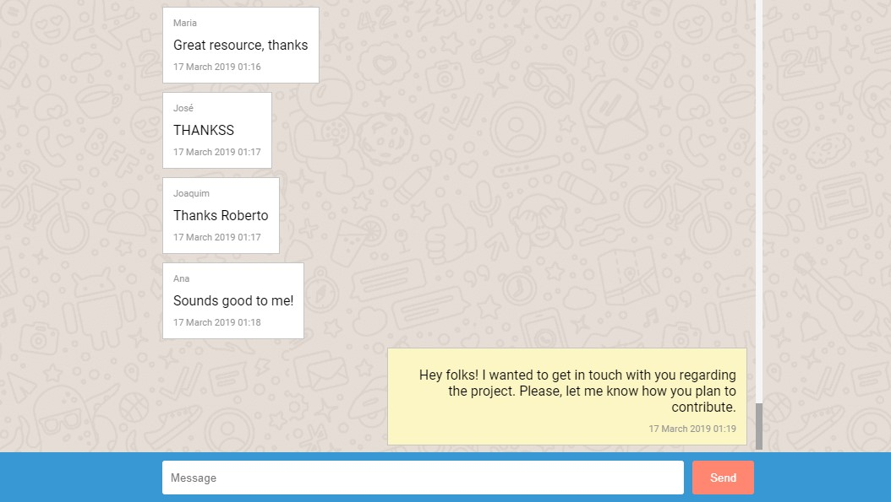

# Simple Chat

Simple chat app implemented by using Vanilla JS.

## Development server

Run `npm start` for a dev server. Navigate to `http://localhost:8080`.

## Running unit tests

Run `npm test` to execute the unit tests via [JEST](https://jestjs.io/).

